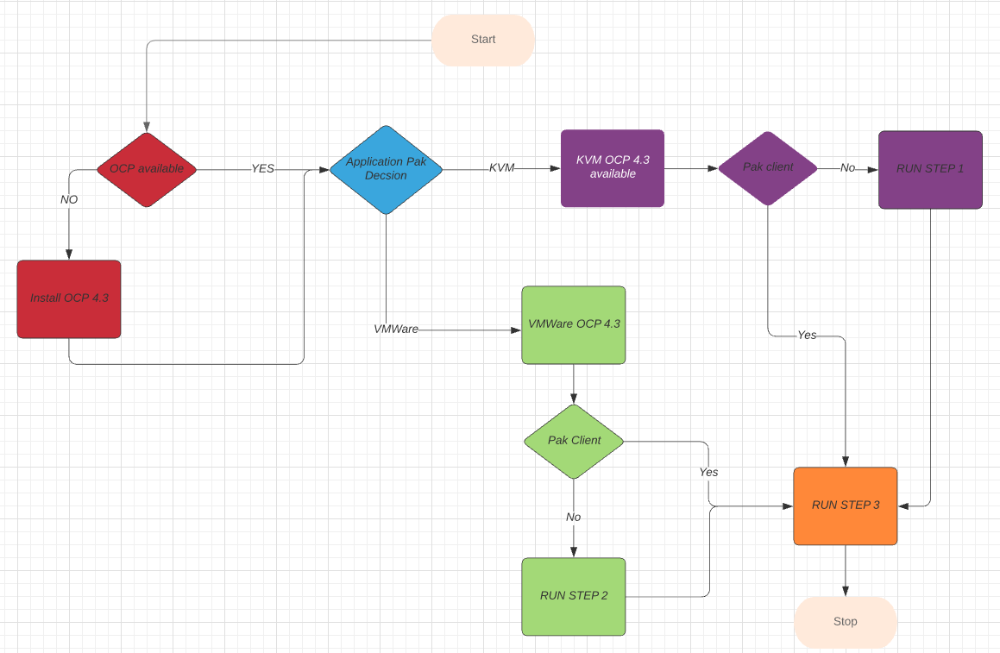
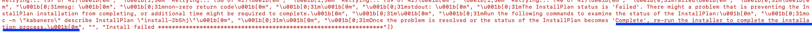

Installing CP4App 4.X
========================================


The guide will get you up and running with the CP4App 4.x (CP4App). on OCP 4.3. The setup assumes OCP 4.3 is already installed and administration rights access available to deploy the Cloud Pak.
The guide assumes OCP 4.3 installed using the same GitHub repository if this is not the case, please make sure the OCP worker node capacity matches the following table:  

## Hardware requirements

| Software      | vCPU   | Mem  | HDD | Node
| ------          | ------: |----:  | ---: | ------: |
| Kabanero Enterprise |  8 | 20 | 25 | 2|
| Transformation Advisor |  2  | 8 | 8 |  |
| Application Navigator |  1 | 3 | 3 |  |
| Total |  12 | 24.5 | 36 | 2 |


Deploying the Application Pak
------------------------------------

The installation supports two install options, either VMWare or KVM, and both will deploy a VM guest if required. The VM guest is called PakHelper and the node acts as a client to install CP4App. There is no reason to deploy a VM guest client if you already have a VM guest CentOS 7 node available in the same network. If this is already in place, please skip step 1. If you do not have a guest client available, execute step 1 and step 2. Please follow the Flowchart to figure out which steps need to be performed in your environment.



Step One for KVM Only
---------------------
---------------------

### Prepare the Host KVM ####

Login to the Host KVM as root and execute the following commands.
```
cd /opt
git clone https://github.com/fctoibm/apppak4.x.git
cd /opt/apppak4.x
```

Edit the [kvmvars.yaml](./kvmvars.yaml) file with the IP addresses that will be assigned to the PakHelper node. The IP addresses need to be correct in order to properly access the OpenShift servers.
Edit the [hosts](./hosts) file **vmguest** section to match the PakHelper node information. This should be similar to the kvmvars.yaml file.


> **NOTE:** If the setup is performed on a KVM host infrastructure, then delete the iptables forward rules by issuing following commands on KVM host server

```
iptables-save > /root/savedrules_pak.txt
iptables-restore < /root/savedrules.txt
```

### Execute the Playbook ###

This playbook will create the CP4App Helper VM guest on KVM Host. The new VM will access the OCP servers and public network access to download the appropriate yum packages.

> **NOTE:** If the client is already available, please proceed to step 3.

```
Run the playbook to setup the kvmhost
ansible-playbook -v -e @kvmvars.yaml play.yaml -t kvm --limit "kvmhost"
```


Step One for VMWare Only
------------------------
------------------------
Login to the client VM as root and execute the following commands.
```
cd /opt
git clone https://github.com/fctoibm/apppak4.x.git
cd /opt/apppak4.x
```

Edit the [vmwarevars.yaml](./vmwarevars.yaml) file with the IP addresses that will be assigned to the PakHelper node. The IP addresses need to be correct in order to properly access the OpenShift servers.
Edit the [hosts](./hosts) file **vmguest** section to match the PakHelper node information. This should be similar to the vmwarevars.yaml file


### Execute the Playbook ###

This play book will create Application Pak Helper VM guest on VMware Host. The new VM will access the OCP servers and  public network access to download yum packages.


> **NOTE:** If the client is already available, please proceed to option 3.

```
Run the playbook to setup the kvmhost
ansible-playbook -v -e @vmwarevars.yaml play.yaml -t vmware --limit "vmwarehost"
```


Step Three (Client Only)
------------------------
------------------------
Use the appropriate .yaml file for the hypervisor you are using. the -e @<input variable YOUR_VARS.YAML> could be vmwarevars.yaml or kvmvars.yaml

```
ansible-playbook -vv -e @YOUR_VARS.YML play.yaml -t setupapppak --limit "vmguest"
```
*where YOUR_VARS.YAML is either vmwarevars.yaml or kvmvars.yaml depending which Step 1 you performed above.*

> **NOTE:** If the install fails with the following message:  
:red_circle: "Once the problem is resolved or the status of the InstallPlan becomes 'Complete', re-run the installer to complete the installation process."  :red_circle:
it indicates that the install timed out rather than actually failing. Issue the following command to continue the install process from where it left off earlier.



```
ansible-playbook -v -e @YOUR_VARS.YML  play.yaml -t retry --limit "vmguest"

```


### Update IP tables on KVM Host to access OpenShift URL ###


On the KVM Host run the following commands:
```
iptables-restore < /root/savedrules_pak.txt
```


Verify the Cloud Pak for Application Installation
-------------------------------------------------
To verify the installation and proper operation, follow the instructions in the [After installation](https://www.ibm.com/support/knowledgecenter/SSCSJL_4.x/install-icpa-cli.html/ "After installation link")  section.
